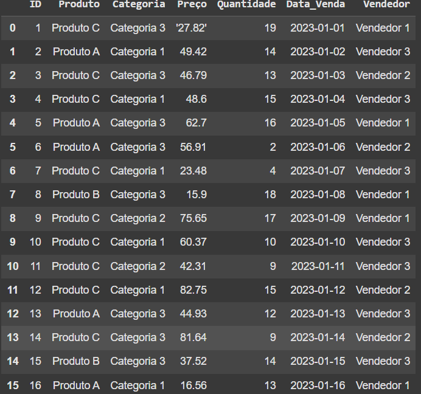
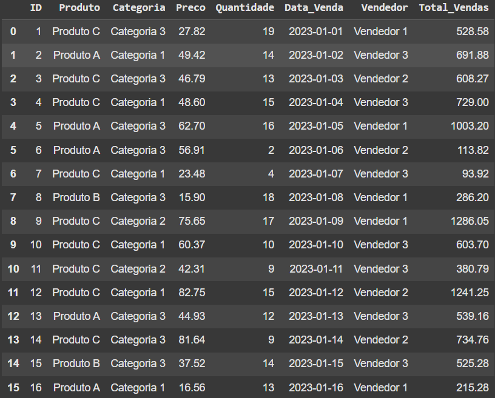

# 🧼 Limpeza de Dados - Vendas Fictícias

Este projeto tem como objetivo demonstrar um processo simples de **limpeza e preparação de dados** utilizando um dataset fictício de vendas. Ele serve como base prática para quem deseja aprender como tratar dados reais em Python com Pandas.

---

## 📝 Etapas Realizadas

- Carregamento do dataset CSV
- Visualização e análise inicial dos dados
- Verificação e tratamento de valores ausentes (missing values)
- Conversão de tipos de dados
- Cálculo de uma nova coluna (`Total_Vendas`)
- Renomeação de colunas
- Exportação para um novo CSV limpo

---

## 💻 Executar no Google Colab

Clique no botão abaixo para executar o código diretamente no Google Colab:

---

## 🖼️ Comparação Antes e Depois

| Dados Originais | Dados Após Limpeza |
|-----------------|--------------------|
|  |  |

---

## 📦 Requisitos

Para rodar o projeto localmente, instale os seguintes pacotes Python:

